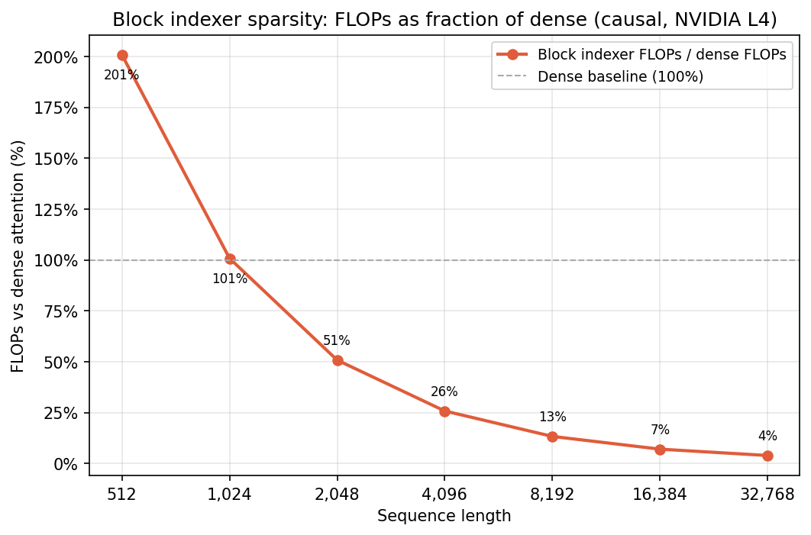
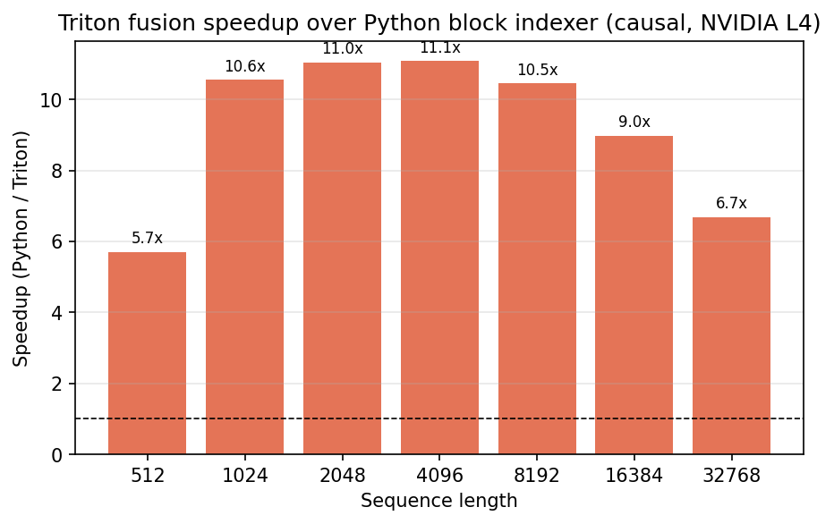
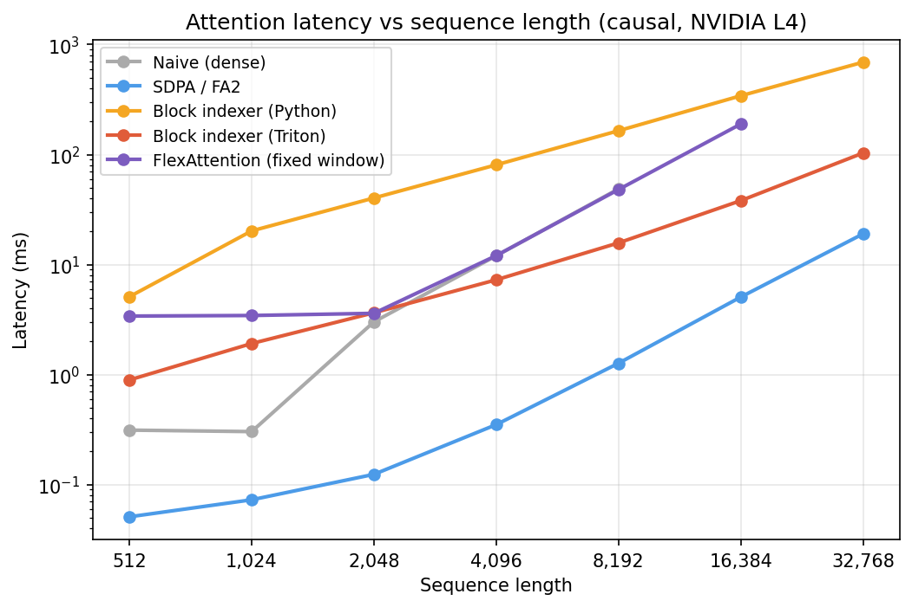
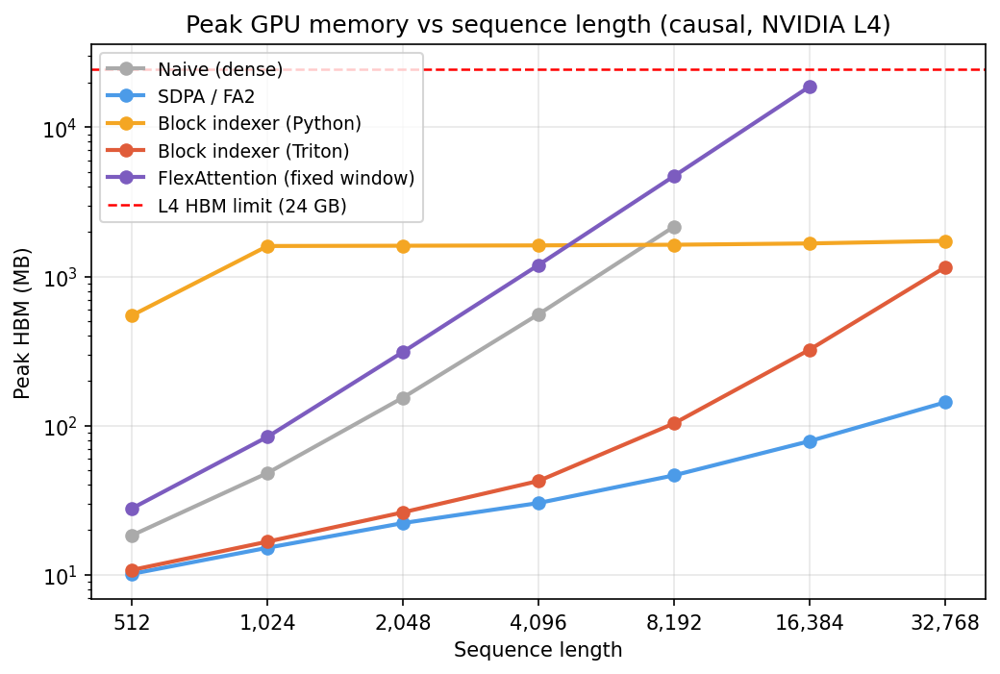

# Content-Adaptive Sparse Attention Kernel for Long-Context Inference

*A novel Triton kernel that picks which tokens to attend to at runtime*

I started this trying to understand why attention is still slow at long context even with FlashAttention-2. Turns out FA2 is solving the wrong problem once you're past 8k tokens.

## Key finding

At 32k context, my Triton kernel computes 3.9% of dense attention's FLOPs (87.2B vs 2.24T), peaks at 1.13GB HBM, and is 58x more memory-efficient than PyTorch FlexAttention. Naive dense attention runs out of memory above 8k context. FlexAttention fails attempting a 64GB allocation at 32k.

The kernel fuses block selection and online softmax into a single GPU launch. The sparsity pattern is not fixed at compile time. It is determined per query, per forward pass, based on actual content.

---

## The two-phase problem

Attention has two scaling problems, and they occur at different sequence lengths.

**Phase 1: memory bandwidth (short context).**

Standard attention materializes an N×N score matrix in HBM. At a sequence length of 8,192, with batch=1, heads=8, head_dim=64 in BF16, that matrix is 8.6GB. Reading and writing it is what makes naive attention slow, not the matrix multiply itself.

FlashAttention-2 solves this. It tiles the computation into blocks that fit in SRAM, so the N×N matrix never has to be written to HBM. At 8k context, FA2 runs in 1.27ms and peaks at 46.4MB HBM. Naive attention takes 48.75ms and peaks at 2.16GB. **38x lower latency and 46x lower peak HBM, at identical FLOP count.**
 
FA2's win is memory IO reduction, not fewer FLOPs (floating point operations).

**Phase 2: compute (long context).**

Even with perfect IO efficiency, the O(N²) FLOP count becomes the bottleneck. At N=32,768, dense attention requires 2.24 trillion FLOPs per forward pass. You cannot tile your way out of that. You need fewer FLOPs.

That is where sparse attention comes in.

---

## Two-stage block indexer

The approach I took is a two-stage block-sparse mechanism.

**Stage 1: coarse scoring.**

Divide the key sequence into blocks of size B (64 in this benchmark). For each block, compute a representative vector by mean-pooling the keys within it. Score each query against every block representative: Q @ K_block_repr.T. This produces a score per (query, block) pair in O(N × N/B) operations instead of O(N²).

**Stage 2: fine attention.**

For each query, take the top-k highest-scoring blocks. Run dense attention only over those k×B tokens. Use this as the actual attention output.

The result: instead of attending to N tokens per query, each query attends to k×B tokens. At N=32,768, B=64, k=16, that is 1,024 tokens instead of 32,768. 

**3.9% of the FLOP count of dense attention.**

Each query selects different blocks, determined by what that query scores highest on. The sparsity pattern is decided at runtime, not fixed at compile time.

At short context, the block indexer costs more than dense attention. The coarse scoring stage adds overhead that is not worth it when N is small. The crossover happens around 2k tokens. Past that, the savings compound.

---

## Why Python is not enough

I first implemented this in Python and PyTorch. The logic is correct and the math works. At 32k context, the Python block indexer runs on 87.2B FLOPs instead of 2.24T.

This is slow. At N=4,096, it takes 80.7ms.

The reason is kernel launches. The fine attention stage loops over top-k blocks and runs a separate PyTorch attention call per block. At N=4,096 with k=16 blocks per query, across all query chunks, this is approximately 450 kernel launches. Each launch carries ~10-20μs of overhead. 450 launches x 10 μs/launch = 4.5ms of pure overhead before any real work happens. 

Here, the math isn't the problem. PyTorch cannot fuse a loop whose iterations depend on runtime top-k indices. Every iteration is a separate GPU dispatch. That's why I started looking at Triton.

---

## The Triton kernel

The solution is a hand-written Triton kernel that fuses the entire fine-attention stage into a single kernel launch per (batch, head, query) triple.

The kernel uses **online softmax** to avoid materializing the full score matrix over top-k blocks. Instead of computing all k scores, writing them to HBM, running softmax, writing again, and then computing the weighted sum, the kernel maintains a running state:

- `m_i` — the current running maximum
- `l_i` — the running sum of exponentials
- `acc` — the unnormalized output accumulator

These update block by block as the kernel loops through the top-k block list. Intermediate scores and attention weights never get stored in HBM. They live in registers.

This is the same trick FlashAttention-2 uses for the dense case, applied to a sparse, runtime-determined block list.

The result: ~450 kernel launches reduced to 3. Wall-clock latency at N=4,096 drops from 80.7ms to 7.3ms. **11x speedup from fusion alone, with identical math.**

The speedup ranges from 5.7x at 512 tokens to 11.1x at 4k tokens. Same algorithm. Same math. Same block structure. The only difference is whether the fine attention stage runs as 450 dispatches or 3.

Two things I wish I knew before starting. First, Triton pointer arithmetic requires int32 indices. Top-k block indices must be cast to int32 before being passed into the kernel. int64 causes silent incorrect output, not an error. I did not figure this out quickly. Second, the kernel definition must live inside an `if TRITON_AVAILABLE:` guard at the module level. `@triton.jit` executes at import time, so it will crash on CPU-only machines if defined at module scope.

---

## FlexAttention comparison

PyTorch FlexAttention (2.5+) compiles custom attention masks into Triton kernels via torch.compile. It is a strong tool for fixed sparsity patterns: sliding window, local attention, causal masking with custom logic. If the sparsity pattern is known at compile time, FlexAttention will produce an efficient kernel for it.

This kernel solves a different problem. The sparsity pattern is determined at runtime per query, based on actual content. torch.compile can't fuse over runtime-determined indices. Stage 1 handles this dynamically.

For the benchmark, FlexAttention was given a fixed sliding-window pattern at the same token density as my kernel (k×B tokens per query). At 16k context, FlexAttention peaks at 18.31GB HBM. My kernel peaks at 322.8MB. **58x lower peak memory.**

At 32k context, FlexAttention fails entirely, attempting a 64GB allocation on a 22GB GPU.

---

## Results

All benchmarks run on NVIDIA L4 (sm_89, 22GB HBM) with batch=1, heads=8, head_dim=64, BF16, block_size=64, top_k=16.

The Triton kernel closes the gap on SDPA at long context as the O(N²) compute cost starts to dominate. At 32k, naive attention is off the chart entirely.

The dashed red line marks the L4's 24GB HBM limit. FlexAttention's line ends at 16k because it OOMs at 32k. The Triton kernel stays flat - memory usage barely grows with sequence length because the attended token count is fixed at k×B regardless of N.

---

## Caveats

**Inference only.** There is no backward pass. The kernel cannot be used for training in its current form.

**FlexAttention was not fully compiled.** In my benchmark, torch.compile triggered a warning that flex_attention was not being compiled into a fused kernel. The FlexAttention latency numbers are therefore an upper bound. Memory usage does not depend on compilation status, and the OOM at 32k is real regardless.

**Fixed hyperparameters.** block_size=64 and top_k=16 are fixed. Different values change the FLOPs ratio and approximation quality. I did not sweep these.

---

## What's next

Two directions I think are underexplored in open-source:

**Backward pass.** A differentiable version would make this usable for training, which is where sparse attention matters most. The math follows from differentiating through the sparse softmax-weighted sum over selected blocks. The hard part is that Triton has limited autodiff support, so the backward kernel needs to be written manually. FA2's backward pass is the reference for the dense case. A clean open-source backward pass for runtime-adaptive sparse attention does not exist yet.

**Per-head sparsity budgets.** Right now top_k is uniform across all heads. Different heads attend differently - some are local, some are global, some track syntax while others track semantics. Letting each head pick its own top_k at runtime makes sense, and from what I can find it has not been done cleanly in open-source. Most of the work is already done: Stage 1 already produces per-head coarse scores. The change is letting top_k vary per head rather than fixing it globally.

---

## Stack

Python, PyTorch, Triton, GCP L4 (sm_89)

Code: [github.com/n26modi/triton-sparse-attention-bench](https://github.com/n26modi/triton-sparse-attention-bench)
